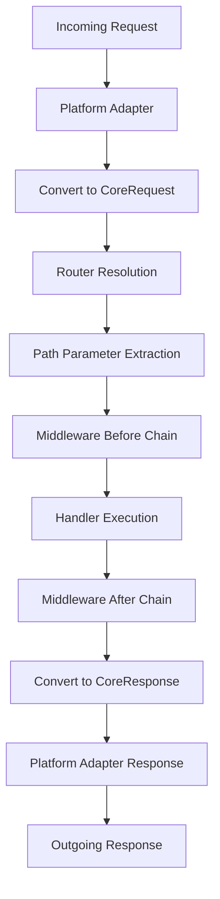

# Xeno — A Lightweight, Portable Web Framework for Rust

**Inspired by the Hono web framework architecture**

> **Tagline:** *Tiny core. Universal adapters.*  
> **Mission:** A minimal yet practical web framework that enables the same `Request → Response` core logic to be deployed across multiple hosting environments through lightweight adapters, including **Cloudflare Workers** and **hyper-based servers**.

## 0. Design Philosophy & Core Concepts

### Architectural Principles

- **Minimal Dependencies**: Built on a foundation of `http` and `bytes`, following a unified **Single Path** approach: `Request<Bytes> → Response<Bytes>`
- **Universal Deployment**: Platform-agnostic core with swappable **adapters** (hyper, workers-rs, and future platforms)
- **Intentionally Minimal**: Progressive enhancement starting from **Essential Features Only** - routing, extraction, responses, and middleware
- **Standards-Based Contracts**: OpenAPI-driven **type-safe client generation** without intermediate BFF layers (tRPC-style)
- **Platform-Agnostic Business Logic**: Core application logic remains deployment-independent, with environment-specific I/O abstracted through `Ctx` injection

### Design Goals

1. **Portability**: Write once, deploy anywhere with adapter swapping
2. **Performance**: Zero-cost abstractions with minimal runtime overhead
3. **Type Safety**: Compile-time guarantees throughout the request/response lifecycle
4. **Developer Experience**: Intuitive APIs with comprehensive tooling support
5. **Production Ready**: Built-in OpenAPI generation and client SDK generation

## 1. Scope Definition & MVP Boundaries

### MVP Core Features

#### Request Handling Pipeline
- **Routing**: HTTP method matching (GET/POST/PUT/DELETE), path parameters, and wildcard patterns
- **Extraction**: Type-safe parameter extraction via `Path<T>`, `Query<T>`, and `Json<T>`
- **Response Generation**: `IntoResponse` trait supporting `Bytes`, `String`, `Json<T>`, and `StatusCode`
- **Middleware System**: Before/after request processing with composable middleware chain
- **Error Handling**: Structured error handling using `thiserror` with HTTP status code mapping

#### Platform Support
- **hyper Adapter**: Support for any server environment using tokio + hyper
- **Cloudflare Workers Adapter**: WASM-based deployment via `workers-rs`
- **OpenAPI Integration**: Automatic specification generation with TypeScript client generation

### Post-MVP Features (Future Phases)

- Server-Sent Events (SSE) and streaming responses
- WebSocket support
- Tower ecosystem compatibility
- WASI-HTTP and Compute@Edge adapters  
- Observability integration (tracing/OpenTelemetry)
- Authentication and authorization middleware
- Built-in CORS and compression middleware

## 2. System Architecture

### Project Structure

```
xeno/
├── core/                    # Platform-agnostic framework core
│   ├── src/
│   │   ├── app.rs          # Main application builder
│   │   ├── router.rs       # Request routing logic
│   │   ├── handler.rs      # Handler trait and implementations
│   │   ├── extract.rs      # Request data extraction
│   │   ├── response.rs     # Response generation
│   │   ├── middleware.rs   # Middleware system
│   │   ├── context.rs      # Environment abstraction
│   │   └── error.rs        # Error handling
│   └── Cargo.toml
├── adapters/
│   ├── hyper/              # tokio + hyper server adapter
│   │   ├── src/lib.rs
│   │   └── Cargo.toml
│   └── workers/            # Cloudflare Workers adapter (WASM)
│       ├── src/lib.rs
│       └── Cargo.toml
├── examples/
│   ├── hello-hyper/        # Basic hyper server example
│   └── hello-workers/      # Basic Workers deployment example
└── tools/
    └── openapi-gen/        # OpenAPI specification generator
```

### Architectural Layers

1. **Core Layer**: Platform-agnostic request processing logic
2. **Adapter Layer**: Platform-specific protocol translation
3. **Application Layer**: User-defined business logic and handlers
4. **Tooling Layer**: Development and deployment utilities

## 3. Request Processing Lifecycle

### Request Flow Architecture



### Detailed Processing Steps

1. **Request Ingestion**: Platform adapter receives native request (hyper::Request or workers::Request)
2. **Normalization**: Convert to standardized `CoreRequest` format
3. **Route Resolution**: Router matches request path and method, extracting path parameters
4. **Parameter Storage**: Path parameters stored in `req.extensions()` for later extraction
5. **Middleware Processing**: Execute before-middleware chain in registration order
6. **Handler Execution**: Invoke matched route handler with context and request
7. **Response Middleware**: Execute after-middleware chain in reverse order
8. **Response Conversion**: Transform `CoreResponse` back to platform-specific format
9. **Response Delivery**: Platform adapter sends response to client

## 4. Core API Design

### Fundamental Types

```rust
// Core request/response types
pub type CoreRequest = http::Request<bytes::Bytes>;
pub type CoreResponse = http::Response<bytes::Bytes>;

// Result type for error handling
pub type Result<T> = std::result::Result<T, Error>;
```

### Handler Interface

```rust
#[async_trait::async_trait]
pub trait Handler<C: Send + Sync + Clone + 'static> {
    async fn call(&self, ctx: C, req: CoreRequest) -> Result<CoreResponse>;
}

// Blanket implementation for functions
impl<C, F, Fut> Handler<C> for F
where
    C: Send + Sync + Clone + 'static,
    F: Fn(C, CoreRequest) -> Fut + Send + Sync,
    Fut: Future<Output = Result<CoreResponse>> + Send,
{
    async fn call(&self, ctx: C, req: CoreRequest) -> Result<CoreResponse> {
        self(ctx, req).await
    }
}
```

### Application Builder

```rust
pub struct App<C> {
    router: Router<C>,
    middleware: Vec<Arc<dyn Middleware<C>>>,
    context: C,
}

impl<C: Clone + Send + Sync + 'static> App<C> {
    pub fn new(context: C) -> Self { /* ... */ }
    
    // HTTP method handlers
    pub fn get(self, path: &str, handler: impl Handler<C>) -> Self { /* ... */ }
    pub fn post(self, path: &str, handler: impl Handler<C>) -> Self { /* ... */ }
    pub fn put(self, path: &str, handler: impl Handler<C>) -> Self { /* ... */ }
    pub fn delete(self, path: &str, handler: impl Handler<C>) -> Self { /* ... */ }
    
    // Middleware registration
    pub fn layer(self, middleware: impl Middleware<C>) -> Self { /* ... */ }
    
    // Route groups with shared middleware
    pub fn group<F>(self, path_prefix: &str, config: F) -> Self 
    where F: FnOnce(Self) -> Self { /* ... */ }
    
    // Core request processing
    pub async fn handle(&self, req: CoreRequest) -> CoreResponse { /* ... */ }
}
```

## 5. Request Data Extraction

### Extractor Trait System

```rust
#[async_trait::async_trait]
pub trait FromRequest<C>: Sized {
    type Rejection: IntoResponse;
    
    async fn from_request(ctx: &C, req: &CoreRequest) -> Result<Self, Self::Rejection>;
}

// Path parameter extraction
pub struct Path<T>(pub T);
impl<C, T> FromRequest<C> for Path<T> 
where T: DeserializeOwned { /* ... */ }

// Query string extraction
pub struct Query<T>(pub T);
impl<C, T> FromRequest<C> for Query<T> 
where T: DeserializeOwned { /* ... */ }

// JSON body extraction
pub struct Json<T>(pub T);
impl<C, T> FromRequest<C> for Json<T> 
where T: DeserializeOwned { /* ... */ }

// Request headers
pub struct Headers(pub HeaderMap);
impl<C> FromRequest<C> for Headers { /* ... */ }
```

### Handler Function Macros

```rust
// Procedural macro for automatic extraction
#[handler]
async fn get_user(
    Path(user_id): Path<u64>,
    Query(params): Query<UserQuery>,
    ctx: Ctx,
) -> Result<Json<User>> {
    let user = ctx.database.get_user(user_id, &params).await?;
    Ok(Json(user))
}
```

## 6. Response Generation System

### IntoResponse Trait

```rust
pub trait IntoResponse {
    fn into_response(self) -> CoreResponse;
}

// Implementations for common types
impl IntoResponse for &str { /* ... */ }
impl IntoResponse for String { /* ... */ }
impl IntoResponse for Bytes { /* ... */ }
impl IntoResponse for StatusCode { /* ... */ }
impl<T: Serialize> IntoResponse for Json<T> { /* ... */ }
impl<T: IntoResponse> IntoResponse for (StatusCode, T) { /* ... */ }
impl<T: IntoResponse> IntoResponse for (HeaderMap, T) { /* ... */ }
```

### Response Helper Types

```rust
// JSON response with proper content-type
pub struct Json<T>(pub T);

// HTML response
pub struct Html(pub String);

// Binary response with MIME type detection
pub struct Binary {
    pub data: Bytes,
    pub content_type: Option<String>,
}

// Redirect responses
pub struct Redirect {
    pub location: String,
    pub status: StatusCode, // 301, 302, 307, 308
}
```

## 7. Context Abstraction Layer

### Environmental I/O Abstraction

The context system enables platform-agnostic business logic by abstracting environment-specific I/O operations:

```rust
#[async_trait::async_trait]
pub trait KeyValueStore: Send + Sync {
    async fn get(&self, key: &str) -> Option<Bytes>;
    async fn put(&self, key: &str, value: Bytes, ttl: Option<Duration>);
    async fn delete(&self, key: &str);
    async fn list(&self, prefix: &str) -> Vec<String>;
}

#[async_trait::async_trait]  
pub trait DatabaseConnection: Send + Sync {
    async fn query(&self, sql: &str, params: &[Value]) -> Result<QueryResult>;
    async fn execute(&self, sql: &str, params: &[Value]) -> Result<u64>;
    async fn transaction<F, R>(&self, f: F) -> Result<R>
    where F: FnOnce(&dyn DatabaseConnection) -> BoxFuture<Result<R>> + Send;
}

#[derive(Clone)]
pub struct Ctx {
    pub kv: Option<Arc<dyn KeyValueStore>>,
    pub db: Option<Arc<dyn DatabaseConnection>>,
    pub secrets: Arc<dyn SecretStore>,
    pub clock: Arc<dyn Clock>,
    // Future extensions: cache_api, r2, d1, etc.
}
```

### Platform-Specific Implementations

- **Workers Adapter**: Wraps `env.kv("NAMESPACE")`, D1 database, and Workers APIs
- **hyper Adapter**: Integrates with Redis, PostgreSQL, file systems, or in-memory implementations
- **Testing**: Mock implementations for unit testing isolation

## 8. Middleware Architecture

### Middleware Trait Design

```rust
#[async_trait::async_trait]
pub trait Middleware<C>: Send + Sync {
    async fn before(&self, ctx: &C, req: &mut CoreRequest) -> Result<Option<CoreResponse>>;
    async fn after(&self, ctx: &C, req: &CoreRequest, res: &mut CoreResponse) -> Result<()>;
}

// Convenience trait for simpler middleware
#[async_trait::async_trait]
pub trait BeforeMiddleware<C>: Send + Sync {
    async fn before(&self, ctx: &C, req: &mut CoreRequest) -> Result<()>;
}

// Blanket implementation
impl<C, M> Middleware<C> for M 
where M: BeforeMiddleware<C> {
    async fn before(&self, ctx: &C, req: &mut CoreRequest) -> Result<Option<CoreResponse>> {
        BeforeMiddleware::before(self, ctx, req).await?;
        Ok(None)
    }
    
    async fn after(&self, _: &C, _: &CoreRequest, _: &mut CoreResponse) -> Result<()> {
        Ok(())
    }
}
```

### Built-in Middleware Components

```rust
// Request logging middleware
pub struct Logger {
    format: LogFormat,
    level: log::Level,
}

// Error handling and formatting
pub struct ErrorHandler {
    development_mode: bool,
    custom_formatters: HashMap<StatusCode, Box<dyn Fn(&Error) -> String>>,
}

// CORS handling
pub struct Cors {
    allowed_origins: Vec<String>,
    allowed_methods: Vec<Method>,
    allowed_headers: Vec<HeaderName>,
    max_age: Duration,
}

// Request timeout
pub struct Timeout {
    duration: Duration,
}
```

## 9. OpenAPI Integration & Type Safety

### Specification Generation

```rust
// Route registration with OpenAPI metadata
impl<C> App<C> {
    pub fn get_with_docs<H, R>(
        self, 
        path: &str, 
        handler: H, 
        docs: OpenApiDocs
    ) -> Self 
    where 
        H: Handler<C> + OpenApiHandler<R>,
        R: JsonSchema + Serialize,
    { /* ... */ }
}

// OpenAPI documentation builder
pub struct OpenApiDocs {
    pub summary: Option<String>,
    pub description: Option<String>,
    pub tags: Vec<String>,
    pub deprecated: bool,
}

// Automatic schema derivation
#[derive(Serialize, Deserialize, JsonSchema)]
pub struct UserResponse {
    pub id: u64,
    pub name: String,
    pub email: String,
    pub created_at: DateTime<Utc>,
}
```

### Client Generation Pipeline

1. **Specification Collection**: Gather route metadata during application setup
2. **Schema Generation**: Use `schemars` for JSON Schema derivation from Rust types
3. **OpenAPI Export**: Generate `openapi.json` via build script or runtime endpoint
4. **TypeScript Generation**: Use `openapi-typescript` for type definitions
5. **Client Generation**: Use `orval` for typed HTTP clients with React Query integration
6. **CI Integration**: Automated type checking and drift detection in build pipeline

## 10. Security & Performance Considerations

### Security Measures

- **Information Disclosure Prevention**: Structured error handling that prevents sensitive information leakage
- **Content-Type Enforcement**: Explicit content-type headers for all responses
- **UTF-8 Compliance**: Consistent UTF-8 encoding for JSON responses
- **Input Validation**: Built-in request validation with detailed error reporting
- **CSRF Protection**: Optional middleware for state-changing operations

### Performance Optimizations

- **Zero-Copy Architecture**: Request/response bodies remain as `Bytes` to minimize allocations
- **Efficient Routing**: `matchit` crate for O(1) route resolution
- **Minimal Middleware Overhead**: Lightweight middleware composition with early termination
- **Platform-Specific Optimizations**:
  - **hyper**: Leverages hyper's performance optimizations and connection pooling  
  - **Workers**: Utilizes Cache API, Keep-Alive connections, and edge compute benefits

## 11. Implementation Roadmap

### Phase 0: Repository Foundation ✅
- [x] Workspace structure (core/, adapters/, examples/, tools/)
- [x] CI pipeline (lint, format, test, coverage)
- [x] MSRV specification and toolchain configuration
- [x] License and documentation foundation

**Exit Criteria**: `cargo test` passes across all crates, project structure finalized

### Phase 1: Core Framework (In Progress)
- [ ] `CoreRequest`/`CoreResponse` type definitions
- [ ] `App` builder and `Handler` trait implementation  
- [ ] Router implementation using `matchit`
- [ ] `IntoResponse` for basic types (`&str`, `String`, `Bytes`, `Json<T>`)
- [ ] Error handling with HTTP status mapping
- [ ] Request extraction: `Path<T>`, `Query<T>`, `Json<T>`

**Exit Criteria**: Core unit tests demonstrate 200/404/400 response handling

### Phase 2: hyper Adapter
- [ ] HTTP server integration with hyper
- [ ] Core I/O conversion layer
- [ ] Example application: `hello-hyper` with GET `/hello` endpoint

**Exit Criteria**: `curl localhost:8080/hello` returns "hello" response

### Phase 3: Workers Adapter  
- [ ] `workers-rs` integration for Cloudflare Workers
- [ ] Request/response translation for Worker environment
- [ ] KV store implementation for `Ctx`
- [ ] Example application: `hello-workers` with local development

**Exit Criteria**: Local development with `wrangler dev` and production deployment successful

### Phase 4: Middleware System
- [ ] Before/after middleware chain implementation
- [ ] Logging and error formatting middleware examples
- [ ] Route group middleware application API

**Exit Criteria**: Request logging and 500 → JSON error transformation functional

### Phase 5: OpenAPI Integration
- [ ] Route registration metadata collection
- [ ] OpenAPI specification builder
- [ ] `/openapi.json` endpoint or build-time generation
- [ ] TypeScript client generation example using `orval`

**Exit Criteria**: Generated TypeScript types and client successfully used in example application

### Phase 6: Developer Experience Enhancement
- [ ] Standardized error response format (problem+json compatible)
- [ ] Cache-Control and ETag helpers for routes
- [ ] Comprehensive getting started documentation

**Exit Criteria**: Multiple example applications (users, notes) with published documentation

### Phase 7+: Advanced Features (Future)
- [ ] Server-Sent Events (SSE) and streaming support
- [ ] WebSocket abstraction (Workers WebSocketPair / hyper + tokio-tungstenite)
- [ ] Optional Tower ecosystem compatibility layer
- [ ] WASI-HTTP and Fastly Compute@Edge adapters
- [ ] Observability integration (tracing/OpenTelemetry)
- [ ] CLI tooling (`xeno new`, `xeno dev`, `xeno openapi`)

## 12. Example Usage Patterns

### Basic Handler Implementation

```rust
use xeno_core::prelude::*;

#[derive(Serialize, Deserialize, JsonSchema)]
struct User {
    id: u64,
    name: String,
    email: String,
}

#[derive(Deserialize, JsonSchema)]
struct CreateUserRequest {
    name: String,
    email: String,
}

async fn get_user(
    Path(user_id): Path<u64>,
    ctx: Ctx,
) -> Result<Json<User>> {
    match ctx.db.get_user(user_id).await? {
        Some(user) => Ok(Json(user)),
        None => Err(Error::NotFound("User not found".into())),
    }
}

async fn create_user(
    Json(req): Json<CreateUserRequest>,
    ctx: Ctx,
) -> Result<(StatusCode, Json<User>)> {
    let user = ctx.db.create_user(req.name, req.email).await?;
    Ok((StatusCode::CREATED, Json(user)))
}

pub fn build_app(ctx: Ctx) -> App<Ctx> {
    App::new(ctx)
        .layer(Logger::new())
        .layer(ErrorHandler::default())
        .get("/users/:id", get_user)
        .post("/users", create_user)
        .group("/api/v1", |app| {
            app.layer(Cors::permissive())
                .get("/health", health_check)
        })
}
```

### Platform Deployment

```rust
// hyper deployment
#[tokio::main]
async fn main() -> Result<()> {
    let ctx = Ctx::new().with_database(PostgresPool::new().await?);
    let app = build_app(ctx);
    
    xeno_hyper::serve(app)
        .bind("0.0.0.0:8080")
        .await
}

// Workers deployment  
#[event(fetch)]
pub async fn main(req: Request, env: Env, _ctx: worker::Context) -> Result<Response> {
    let ctx = Ctx::from_env(&env)?;
    let app = build_app(ctx);
    
    xeno_workers::handle(app, req).await
}
```

## 13. Testing Strategy

### Test Coverage Architecture

```rust
// Core framework unit tests
#[cfg(test)]
mod tests {
    use super::*;
    
    #[tokio::test]
    async fn test_route_matching() {
        let app = App::new(()).get("/users/:id", |_, _| async { Ok("user") });
        let req = TestRequest::get("/users/123").into();
        let res = app.handle(req).await;
        assert_eq!(res.status(), StatusCode::OK);
    }
    
    #[tokio::test] 
    async fn test_json_extraction() {
        let app = App::new(()).post("/users", create_user);
        let req = TestRequest::post("/users")
            .json(&CreateUserRequest { name: "John".into(), email: "john@example.com".into() })
            .into();
        let res = app.handle(req).await;
        assert_eq!(res.status(), StatusCode::CREATED);
    }
}
```

### Integration Testing

- **Core**: Black-box testing using `CoreRequest`/`CoreResponse` for routing, extraction, and error handling
- **Adapters**: 
  - hyper: Integration tests using `reqwest` HTTP client
  - Workers: Local testing with `workerd` and fetch API calls
- **Contract Testing**: OpenAPI specification snapshot testing to detect type drift

### End-to-End Testing

```rust
// Example integration test
#[tokio::test]
async fn test_user_crud_workflow() {
    let server = TestServer::new(build_app).await;
    
    // Create user
    let user = server.post("/users")
        .json(&CreateUserRequest { name: "Alice".into(), email: "alice@example.com".into() })
        .await
        .expect_status(201)
        .json::<User>();
    
    // Get user
    let retrieved = server.get(&format!("/users/{}", user.id))
        .await
        .expect_status(200)
        .json::<User>();
        
    assert_eq!(user.id, retrieved.id);
    assert_eq!(user.email, retrieved.email);
}
```

## 14. Versioning & Maintenance Strategy

### Semantic Versioning Policy

- **SemVer Compliance**: Strict adherence to semantic versioning principles
- **0.x Period**: Breaking changes allowed with minor version bumps during initial development
- **1.0+ Stability**: Breaking changes only with major version increments
- **LTS Support**: Long-term support for major versions with security backports

### Dependency Management

- **Minimal Dependency Principle**: Core dependencies limited to `http`, `bytes`, `matchit`, `thiserror`, and `serde`
- **Optional Features**: Additional functionality gated behind feature flags to maintain minimal core
- **MSRV Policy**: Minimum Supported Rust Version updated conservatively with 6-month lag from stable releases

### Backwards Compatibility

- **Adapter Stability**: Platform adapters maintain API compatibility within major versions
- **Migration Guides**: Comprehensive upgrade documentation for breaking changes
- **Deprecation Policy**: 2-version deprecation cycle for public APIs

## 15. Naming Conventions & Standards

### Crate Structure
- **Core**: `xeno-core`
- **Adapters**: `xeno-adapter-hyper`, `xeno-adapter-workers`
- **Tools**: `xeno-openapi`, `xeno-cli`
- **Extensions**: `xeno-middleware-cors`, `xeno-auth`

### Type Naming
- **Core Types**: `CoreRequest`, `CoreResponse`, `Context`, `App`, `Handler`
- **Extractors**: `Path<T>`, `Query<T>`, `Json<T>`, `Headers`, `Body`
- **Responses**: `Json<T>`, `Html`, `Binary`, `Redirect`

### Feature Flags
- **OpenAPI**: `openapi` - OpenAPI specification generation
- **Streaming**: `sse` - Server-Sent Events support  
- **WebSockets**: `ws` - WebSocket abstraction
- **Tower**: `tower-compat` - Tower middleware compatibility
- **Tracing**: `tracing` - Observability integration

## 16. Non-Goals & Principles

### Intentional Limitations

- **Macro-Heavy DSLs**: Prefer explicit, learnable APIs over magical macro systems
- **Kitchen Sink Approach**: Maintain focused scope rather than attempting to solve all problems
- **Platform-Specific Optimizations in Core**: Keep platform dependencies in adapters
- **Built-in ORM/Templates**: Focus on HTTP processing, not application architecture
- **UI Framework Integration**: Remain frontend-agnostic

### Design Philosophy

- **Explicitness over Conciseness**: Clear code over clever code
- **Composability over Monoliths**: Small, composable pieces over large, integrated systems  
- **Standards Compliance**: Leverage existing HTTP and web standards rather than inventing new ones
- **Performance by Design**: Architecture for performance from the ground up, not as an afterthought

---

**Xeno represents a Hono-inspired approach to building portable web applications in Rust: "thin core, universal adapters" delivered through the shortest path to production deployment.**